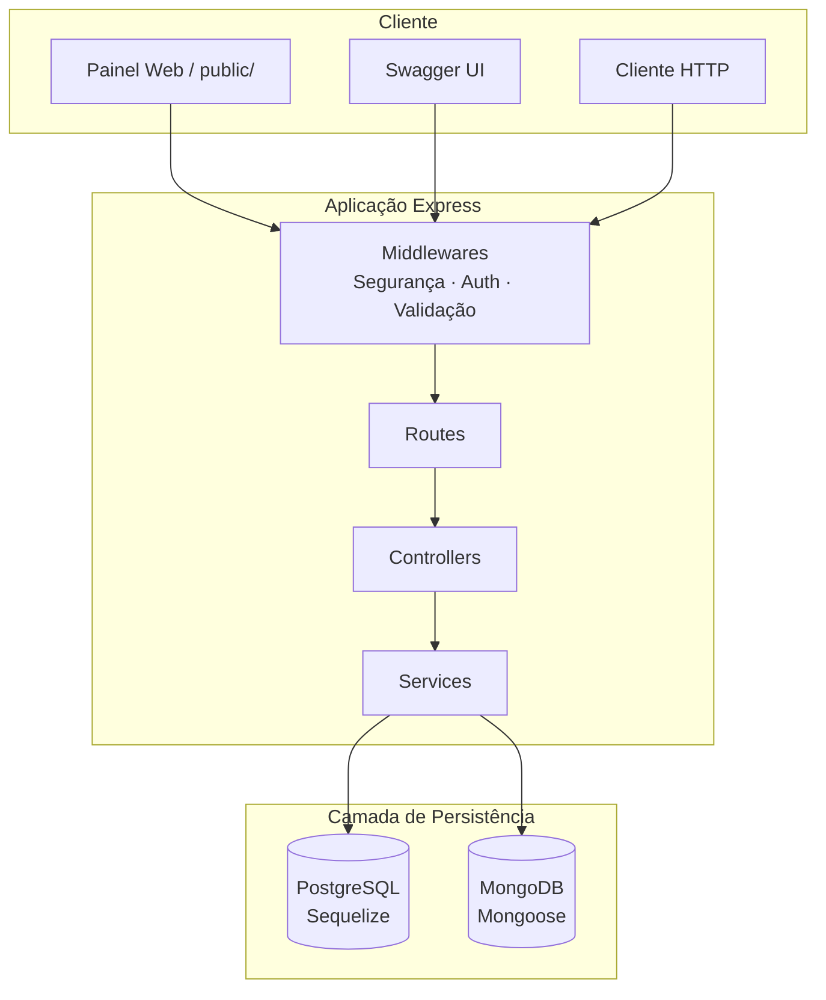
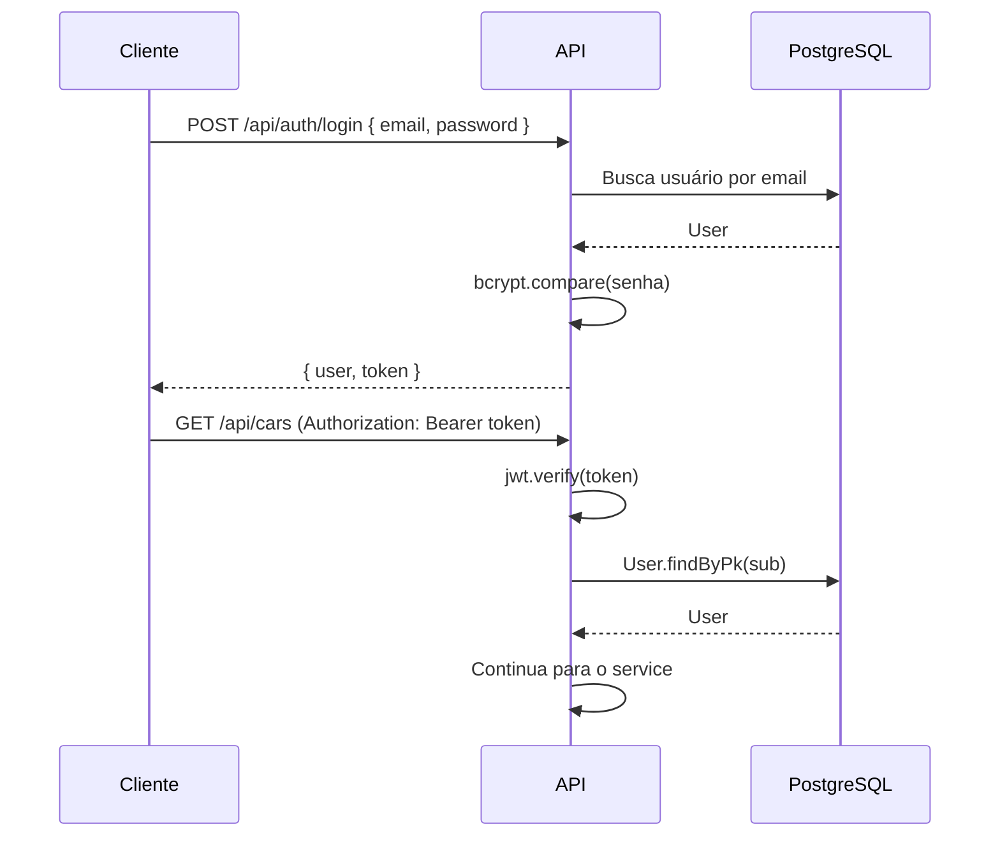
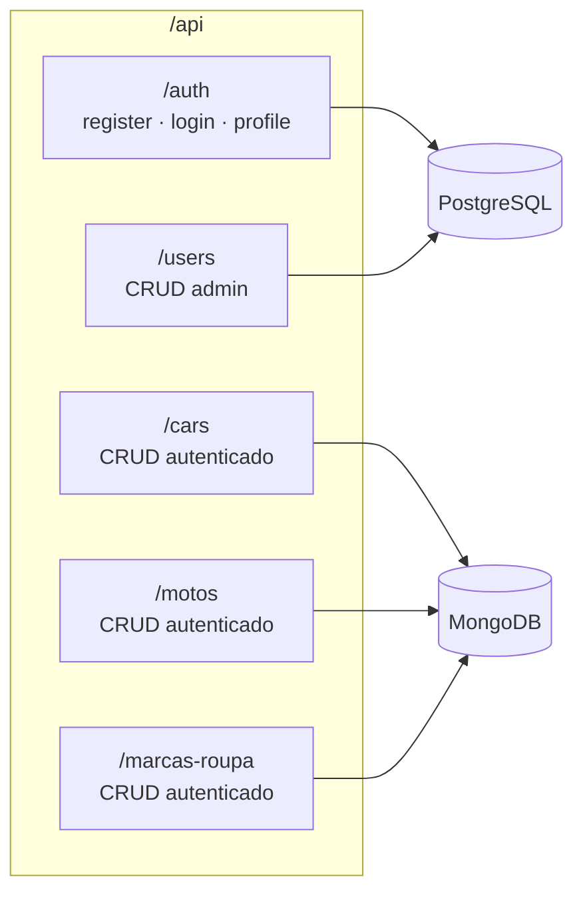

# Documentação Técnica — API Dual Persistence

Documento descritivo da arquitetura, tecnologias e decisões adotadas no projeto.

---

## 1. Propósito do Projeto

A **API Dual Persistence** é uma aplicação REST construída com Node.js e Express que demonstra o uso simultâneo de dois modelos de persistência de dados — relacional (PostgreSQL) e documental (MongoDB) — dentro de uma mesma aplicação.

O objetivo principal é explorar cenários reais em que diferentes tipos de dados se beneficiam de bancos distintos, mantendo uma camada de API unificada, autenticação centralizada e boas práticas de segurança.

---

## 2. Visão Geral da Arquitetura

A aplicação segue uma arquitetura em **camadas** (layered architecture), separando responsabilidades entre roteamento, controle, regras de negócio e acesso a dados.



### Fluxo de uma requisição

1. A requisição entra pelo Express e passa pelos middlewares globais (Helmet, CORS, rate limit, parse JSON).
2. A rota correspondente aplica middlewares específicos (autenticação JWT, autorização por role, validação de entrada).
3. O **controller** recebe a requisição, delega ao **service** e formata a resposta HTTP.
4. O **service** executa a lógica de negócio e interage com o modelo adequado (Sequelize ou Mongoose).
5. Erros são propagados ao middleware central de tratamento de erros.

---

## 3. Estrutura de Diretórios

```
src/
├── config/          # Configurações (env, PostgreSQL, MongoDB, Swagger)
├── controllers/     # Camada HTTP — recebe req/res, chama services
├── middlewares/     # Auth, segurança, validação, tratamento de erros
├── models/          # Modelos Sequelize (User) e Mongoose (Car, Moto, MarcaRoupa)
├── routes/          # Definição de rotas e anotações Swagger
├── services/        # Regras de negócio e acesso a dados
├── utils/           # Utilitários (JWT, AppError)
├── app.js           # Configuração do Express
└── server.js        # Bootstrap — conexões DB e inicialização

public/              # Frontend estático para testes manuais
tests/               # Testes de integração (Jest + Supertest)
```

---

## 4. Persistência Dual — Decisão Central

A principal decisão arquitetural do projeto é **separar os dados por natureza**, atribuindo cada domínio ao banco mais adequado ao seu contexto de uso.

| Domínio            | Banco      | ORM/ODM    | Motivação                                              |
| ------------------ | ---------- | ---------- | ------------------------------------------------------ |
| Usuários / Auth    | PostgreSQL | Sequelize  | Dados estruturados, integridade referencial, roles     |
| Carros             | MongoDB    | Mongoose   | Documentos flexíveis, schema evolutivo                 |
| Motos              | MongoDB    | Mongoose   | Mesmo padrão de entidades de catálogo                  |
| Marcas de Roupa    | MongoDB    | Mongoose   | Entidades independentes, sem relações complexas        |

### Por que PostgreSQL para usuários?

- Credenciais e roles exigem **consistência transacional** e constraints (UNIQUE em email, ENUM de role).
- O fluxo de autenticação consulta o banco a cada requisição protegida (`User.findByPk`), o que se beneficia de um modelo relacional previsível.
- Hooks do Sequelize (`beforeCreate`, `beforeUpdate`) centralizam o hash de senhas com bcrypt.

### Por que MongoDB para catálogos?

- Entidades como carros, motos e marcas de roupa possuem estruturas simples e independentes.
- O modelo documental permite evolução do schema sem migrações formais.
- Identificadores `_id` do MongoDB são validados na camada de entrada (`isMongoId()`).

### Conexões na inicialização

Em `server.js`, ambos os bancos são conectados na sequência:

1. `connectPostgres()` — autentica conexão Sequelize
2. `syncPostgres()` — sincroniza schema (cria tabelas se necessário)
3. `connectMongo()` — conecta via Mongoose
4. `seedAdminUser()` — garante existência de um administrador padrão

---

## 5. Stack Tecnológica

### Runtime e Framework

| Tecnologia   | Versão   | Papel                                      |
| ------------ | -------- | ------------------------------------------ |
| Node.js      | 20       | Runtime JavaScript                         |
| Express.js   | 4.x      | Framework HTTP                             |
| dotenv       | 16.x     | Variáveis de ambiente                      |

### Bancos de Dados

| Tecnologia   | Versão   | Papel                                      |
| ------------ | -------- | ------------------------------------------ |
| PostgreSQL   | 16       | Persistência relacional (usuários)         |
| MongoDB      | 7        | Persistência documental (catálogos)        |
| Sequelize    | 6.x      | ORM para PostgreSQL                        |
| Mongoose     | 8.x      | ODM para MongoDB                           |

### Segurança

| Tecnologia           | Papel                                           |
| -------------------- | ----------------------------------------------- |
| jsonwebtoken         | Autenticação stateless via JWT                  |
| bcryptjs             | Hash de senhas (fator de custo 12)              |
| helmet               | Cabeçalhos HTTP seguros                         |
| express-rate-limit   | Proteção contra brute force e flood             |
| express-validator    | Validação e sanitização de entrada              |
| cors                 | Controle de origens permitidas                  |

### Documentação e Testes

| Tecnologia           | Papel                                           |
| -------------------- | ----------------------------------------------- |
| swagger-jsdoc        | Geração de spec OpenAPI a partir de anotações   |
| swagger-ui-express   | Interface interativa em `/api-docs`             |
| Jest                 | Framework de testes                             |
| Supertest            | Testes de integração HTTP                       |

### Infraestrutura

| Tecnologia           | Papel                                           |
| -------------------- | ----------------------------------------------- |
| Docker               | Conteinerização da aplicação                    |
| Docker Compose       | Orquestração de app, PostgreSQL, MongoDB e testes |

---

## 6. Camadas da Aplicação

### Routes

Definem os endpoints HTTP, aplicam middlewares na ordem correta e contêm anotações JSDoc para o Swagger.

Exemplo de proteção em rotas de carros: todas exigem autenticação JWT (`router.use(authenticate)`).

Rotas de usuários exigem autenticação **e** role `admin` (`authenticate, authorize('admin')`).

### Controllers

Responsáveis apenas pela interface HTTP:

- Extraem dados de `req` (body, params, user)
- Invocam o service correspondente
- Retornam status codes e JSON
- Propagam erros via `next(error)`

Não contêm lógica de negócio nem acesso direto a bancos de dados.

### Services

Concentram a lógica de negócio:

- Verificações de existência e regras de acesso
- Operações CRUD nos modelos
- Lançamento de `AppError` com status HTTP semântico (404, 409, 403)

### Models

- **User** (Sequelize): define schema, hooks de hash e métodos `comparePassword()` / `toSafeJSON()`.
- **Car, Moto, MarcaRoupa** (Mongoose): schemas com validações de campo, timestamps e `versionKey: false`.

---

## 7. Autenticação e Autorização

### Decisão: JWT stateless

A autenticação utiliza **JSON Web Tokens** assinados com segredo configurável (`JWT_SECRET`). O token contém:

- `sub` — ID do usuário no PostgreSQL
- `role` — papel do usuário (`user` ou `admin`)
- Expiração configurável (`JWT_EXPIRES_IN`, padrão 1h)

### Fluxo



### Autorização por roles

| Role   | Permissões                                              |
| ------ | ------------------------------------------------------- |
| user   | CRUD de catálogos (carros, motos, marcas); perfil próprio |
| admin  | Tudo acima + CRUD completo de usuários                  |

O middleware `authorize(...roles)` verifica se `req.user.role` está entre os papéis permitidos.

### Decisão: revalidar usuário a cada requisição

Após decodificar o JWT, a API consulta o PostgreSQL para confirmar que o usuário ainda existe. Isso garante que tokens de usuários removidos sejam invalidados, mesmo com JWT stateless.

---

## 8. Segurança — Decisões OWASP

| Medida                         | Implementação                                           | Referência OWASP        |
| ------------------------------ | ------------------------------------------------------- | ----------------------- |
| Cabeçalhos HTTP seguros        | Helmet (CSP ativo em produção)                          | A05 — Security Misconfiguration |
| Rate limiting global           | 100 req / 15 min por IP                                 | A07 — Identification Failures |
| Rate limiting em auth          | 20 req / 15 min em login/register                       | A07 — Brute Force       |
| Validação de entrada           | express-validator em todos os endpoints                 | A03 — Injection         |
| Limite de payload              | JSON limitado a 10 KB                                   | A04 — Insecure Design   |
| Hash de senhas                 | bcrypt, cost factor 12                                  | A07 — Cryptographic Failures |
| Ocultar stack traces           | Stack exposta apenas fora de produção                   | A05 — Information Exposure |
| Desabilitar x-powered-by       | `app.disable('x-powered-by')`                           | A05 — Fingerprinting    |
| CORS configurável              | Origem controlada via `CORS_ORIGIN`                     | A05 — Misconfiguration  |
| Senhas fortes no cadastro      | Mín. 8 chars, maiúscula, minúscula e número             | A07 — Weak Credentials  |

---

## 9. Tratamento de Erros

### Decisão: classe AppError operacional

Erros de negócio são instâncias de `AppError` com `statusCode` e flag `isOperational`. Isso diferencia erros esperados (404, 409) de falhas inesperadas (500).

### Middleware centralizado

O `errorHandler` normaliza respostas para:

- Erros do Mongoose (`ValidationError`, `CastError`)
- Erros do Sequelize (`SequelizeUniqueConstraintError`)
- Erros operacionais (`AppError`)
- Erros genéricos (500)

Formato de resposta:

```json
{
  "message": "Descrição do erro",
  "errors": [{ "field": "email", "message": "Email invalido" }]
}
```

---

## 10. Validação de Entrada

Toda entrada passa por regras declarativas em `src/validators/index.js` antes de chegar ao service:

- **Usuários**: email normalizado, senha com complexidade, role enum
- **Carros/Motos/Marcas**: campos obrigatórios, limites de tamanho, ranges numéricos
- **Parâmetros de rota**: `isMongoId()` para recursos MongoDB, `isInt()` para usuários PostgreSQL

O middleware `validate` intercepta falhas e retorna HTTP 400 com detalhes por campo.

---

## 11. Documentação da API

### Decisão: Swagger inline nas rotas

A spec OpenAPI 3.0 é gerada via **swagger-jsdoc**, com anotações JSDoc diretamente nos arquivos de rotas e em `app.js`. Isso mantém a documentação próxima do código que ela descreve.

Pontos de acesso:

- Interface interativa: `GET /api-docs`
- Spec JSON: `GET /api-docs.json`

---

## 12. Frontend de Testes

A pasta `public/` serve um painel HTML/CSS/JS estático para testes manuais da API, acessível na raiz (`/`). Não é um SPA completo — funciona como ferramenta auxiliar de desenvolvimento e demonstração.

---

## 13. Testes de Integração

### Decisão: testes end-to-end com banco real

Os testes utilizam **Jest** com **Supertest**, executados em banda (`--runInBand`) contra instâncias reais de PostgreSQL e MongoDB.

Configuração:

- `NODE_ENV=test` desabilita rate limiting
- Banco MongoDB de teste separado (`appdb_test`)
- Setup em `tests/setup.js` para conexões e limpeza
- Profile Docker `test` no Compose para execução containerizada

Cobertura:

- Autenticação (register, login, profile)
- Autorização (admin vs user)
- CRUD completo de todos os recursos
- Validações e tratamento de erros

---

## 14. Infraestrutura Docker

### Serviços no Docker Compose

| Serviço    | Imagem/Base        | Função                              |
| ---------- | ------------------ | ----------------------------------- |
| app        | Node 20 Alpine     | API Express                         |
| postgres   | PostgreSQL 16      | Banco relacional                    |
| mongo      | MongoDB 7          | Banco documental                    |
| test       | Dockerfile.test    | Execução de testes (profile `test`) |

### Decisões de infraestrutura

- **Health checks** em PostgreSQL, MongoDB e na própria app (`/health`) para garantir ordem de inicialização via `depends_on: condition: service_healthy`.
- **Volumes nomeados** (`postgres_data`, `mongo_data`) para persistência entre reinicializações.
- **Rede bridge isolada** (`app-network`) para comunicação interna entre containers.
- **Restart policy** `unless-stopped` na aplicação principal.

---

## 15. Variáveis de Ambiente

| Variável               | Descrição                              | Padrão                          |
| ---------------------- | -------------------------------------- | ------------------------------- |
| `NODE_ENV`             | Ambiente de execução                   | `development`                   |
| `PORT`                 | Porta do servidor                      | `3000`                          |
| `JWT_SECRET`           | Segredo para assinatura JWT            | (obrigatório em produção)       |
| `JWT_EXPIRES_IN`       | Tempo de expiração do token            | `1h`                            |
| `POSTGRES_*`           | Credenciais e host PostgreSQL          | Ver `.env.example`              |
| `MONGODB_URI`          | Connection string MongoDB              | `mongodb://localhost:27017/appdb` |
| `CORS_ORIGIN`          | Origem permitida no CORS               | `*`                             |
| `RATE_LIMIT_*`         | Janela e máximo de requisições         | 15 min / 100 req                |
| `ADMIN_EMAIL`          | Email do admin seed                    | `admin@example.com`             |
| `ADMIN_PASSWORD`       | Senha do admin seed                    | `Admin1234`                     |

---

## 16. Resumo das Decisões Arquiteturais

| #  | Decisão                                      | Alternativa considerada         | Motivo da escolha                                    |
| -- | -------------------------------------------- | ------------------------------- | ---------------------------------------------------- |
| 1  | Persistência dual (PG + Mongo)               | Banco único                     | Demonstrar uso adequado de cada modelo por domínio   |
| 2  | Arquitetura em camadas                       | Monolito sem separação          | Testabilidade, manutenção e clareza de responsabilidades |
| 3  | JWT stateless com revalidação de usuário     | Sessions server-side            | Escalabilidade com invalidação parcial               |
| 4  | Sequelize + Mongoose (ORM/ODM)               | Queries SQL/MQL diretas         | Produtividade, validações e abstração de conexão     |
| 5  | Validação declarativa (express-validator)    | Validação manual nos controllers | Consistência e reuso de regras                       |
| 6  | Erros operacionais centralizados (AppError)  | Try/catch com respostas inline  | Respostas uniformes e separação de concerns          |
| 7  | Swagger inline (JSDoc)                       | Spec OpenAPI separada           | Documentação sempre sincronizada com o código        |
| 8  | Docker Compose com health checks             | Setup manual local              | Ambiente reproduzível e onboarding simplificado    |
| 9  | Rate limit desabilitado em testes            | Mock de middleware              | Testes mais simples sem afetar produção              |
| 10 | Seed automático de admin                     | Migração manual                 | Ambiente funcional imediato após primeiro deploy     |

---

## 17. Diagrama de Componentes



---

**Autora:** Luana Zenha  
**Versão da API:** 1.0.0  
**Licença:** MIT
